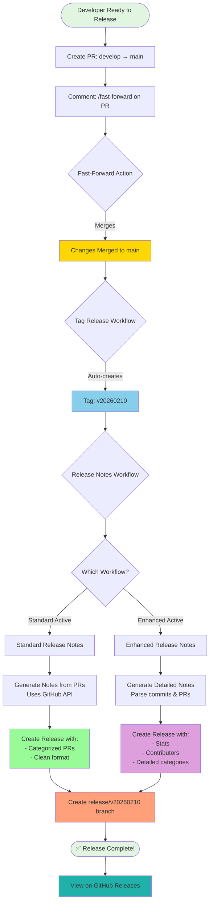
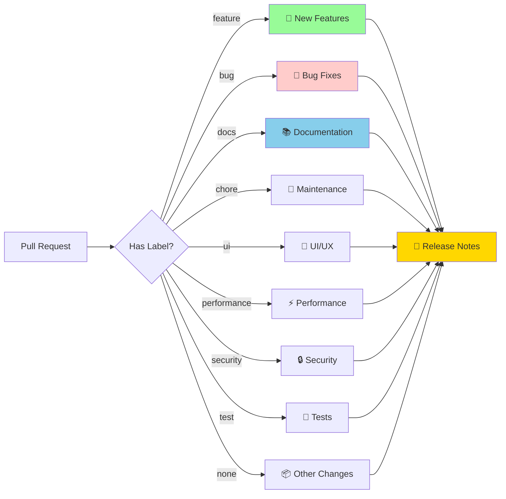

# 🔄 Complete Release Workflow Visualization



## 📊 Workflow Steps Breakdown

### Phase 1: Merge to Main
```
1. Developer creates PR (develop → main)
2. Developer comments: /fast-forward
3. Fast-forward action merges changes
   ⏱️ Time: ~30 seconds
```

### Phase 2: Auto-Tagging
```
4. Push to main triggers tag_release.yml
5. Creates timestamp tag (v20260210)
   ⏱️ Time: ~10 seconds
```

### Phase 3: Release Generation
```
6. Tag creation triggers release workflow
7. Workflow choice:
   
   Option A (Standard):
   - Fetches previous tag
   - Calls GitHub release notes API
   - Categorizes by labels
   - Creates release
   ⏱️ Time: ~20 seconds
   
   Option B (Enhanced):
   - Fetches previous tag
   - Compares commits
   - Extracts PR numbers
   - Fetches PR details
   - Categorizes and formats
   - Adds statistics
   - Lists contributors
   - Creates release
   ⏱️ Time: ~30-40 seconds
```

### Phase 4: Branch Creation
```
8. Creates release/v20260210 branch
9. Pushes to remote
   ⏱️ Time: ~10 seconds
```

### Total Time: ~1-2 minutes (fully automated!)

---

## 🎨 Label-Based Categorization Flow



---

## 🔐 Required Secrets

### GitHub App Configuration
```yaml
secrets:
  APP_ID: Your GitHub App ID
  APP_PRIVATE_KEY: Your GitHub App Private Key
```

### Required Permissions
```yaml
permissions:
  contents: write       # Create releases, tags, branches
  pull-requests: read   # Read PR information
```

---

## 📁 File Structure

```
.github/
├── workflows/
│   ├── fast_forward.yml                    # Merges develop → main
│   ├── tag_release.yml                     # Creates timestamp tags
│   ├── release_notes.yml                   # ✅ ACTIVE: Standard release notes
│   └── enhanced_release_notes.yml.disabled # DISABLED: Enhanced version
├── release.yml                             # Release notes configuration
├── PULL_REQUEST_TEMPLATE.md               # PR template
├── QUICKSTART.md                          # Quick start guide
├── RELEASE_WORKFLOW.md                    # Detailed documentation
└── FLOW_DIAGRAM.md                        # This file!
```

---

## 🎯 Decision Tree: When to Switch Workflows?

```
Start: Which workflow should I use?
│
├─ Need detailed statistics? ────────────[NO]─→ Use Standard
│  └─[YES]
│     │
│     ├─ Want contributor shoutouts? ────[NO]─→ Use Standard
│     │  └─[YES]
│     │     │
│     │     └─ Have time for maintenance? [NO]─→ Use Standard
│        └─[YES]─→ Use Enhanced
```

### Quick Recommendation:
- **Small teams (1-5 people):** Standard
- **Open source with many contributors:** Enhanced
- **Enterprise/corporate:** Standard
- **Community-driven projects:** Enhanced
- **Not sure?** Start with Standard!

---

## 🔄 Example Timeline

```
Time    Event                           Actor
─────────────────────────────────────────────────────────
09:00   Create PR develop→main          Developer
09:05   Comment /fast-forward           Developer
09:05   Fast-forward merge complete     GitHub Action
09:05   Tag v20260210 created          GitHub Action
09:06   Release notes generated         GitHub Action
09:06   Release branch created          GitHub Action
09:07   Email notification sent         GitHub
─────────────────────────────────────────────────────────
✅ Total: ~7 minutes from PR to release!
```

---

## 🎓 Learning Path

1. **Week 1:** Use Standard workflow, practice labeling PRs
2. **Week 2:** Customize categories in `.github/release.yml`
3. **Week 3:** Try Enhanced workflow for a release
4. **Week 4:** Pick your favorite and optimize

---

## 💡 Pro Tips

1. **Label as you create PRs** - easier than going back
2. **Use PR template** - ensures consistent descriptions
3. **Review labels** - before merging to main
4. **Check previous releases** - for consistency
5. **Customize emojis** - make it yours!

---

## 🆘 Troubleshooting Flow

```
Issue: No release created?
│
├─ Check: Tag was created?
│  ├─[NO]─→ Check tag_release.yml workflow logs
│  └─[YES]
│     │
│     ├─ Check: Release workflow ran?
│     │  ├─[NO]─→ Check workflow permissions
│     │  └─[YES]
│     │     │
│     │     └─ Check: Any errors in logs?
│        ├─[YES]─→ Check API rate limits
│        └─[NO]─→ Success! Check GitHub Releases page
```

---

## 🎊 Success Metrics

Track these to improve your release process:

- ✅ % of PRs with labels
- ✅ Average time from merge to release
- ✅ Number of releases per month
- ✅ Team satisfaction with release notes
- ✅ External feedback on release quality

---

## 📞 Need Help?

1. Read [QUICKSTART.md](QUICKSTART.md) for basics
2. Read [RELEASE_WORKFLOW.md](RELEASE_WORKFLOW.md) for details
3. Check GitHub Actions logs for errors
4. Review PR labels and titles
